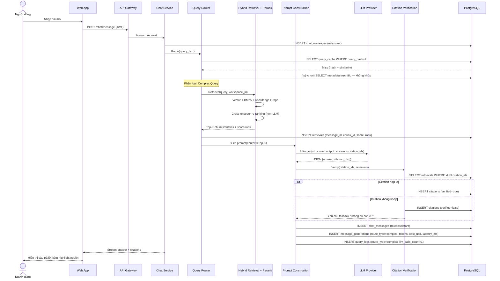

# System Architecture — Enterprise NotebookLM

---

## 1. C4 Model — Component Diagram

Phạm vi: zoom vào bên trong container **Backend API System** (FastAPI) — container trung tâm chứa toàn bộ 13 FR. Hai container ngoài (Web App, LightRAG Core Engine) và các external system giữ nguyên ở mức Container để làm ranh giới.

```mermaid
C4Component
    title Component diagram — Backend API System (Enterprise NotebookLM)

    Person(user, "Nhân viên nội bộ", "Chat, tìm kiếm, tóm tắt, trích xuất, so sánh tài liệu")
    Person(admin, "Admin doanh nghiệp", "Quản lý Workspace, RBAC")

    Container(webapp, "Web App", "Next.js/React", "UI Chat, Search, Upload, Report")
    Container(lightrag, "LightRAG Core Engine", "Dual-level Graph + Vector Index", "Sinh entity/topic/chunk")
    ContainerDb(pg, "PostgreSQL", "RDBMS", "Metadata, users, workspace, chat, log")
    ContainerDb(vecdb, "Vector DB", "Qdrant/pgvector", "Lưu embedding thật")
    ContainerDb(kg, "Knowledge Graph", "Neo4j/NetworkX", "Entity relations")
    ContainerDb(es, "Full-text Search", "Elasticsearch", "BM25 index")
    ContainerDb(objstore, "Object Storage", "MinIO/S3", "File gốc theo version")
    System_Ext(llm, "LLM Provider", "Anthropic API — Claude Haiku/Sonnet")

    Container_Boundary(api, "Backend API System (FastAPI)") {
        Component(gateway, "API Gateway / Auth Middleware", "FastAPI", "Xác thực OAuth2/JWT, RBAC theo Workspace, rate limiting (FR12)")
        Component(workspaceSvc, "Workspace Service", "FastAPI router", "CRUD Workspace, thành viên, quyền (FR1)")
        Component(ingestSvc, "Document Ingestion Service", "FastAPI + Celery producer", "Upload, versioning, checksum, tạo pipeline_run (FR2)")
        Component(pipelineWorker, "Pipeline Worker", "Celery task", "OCR & Cleaning → Chunking → Embedding → Graph Extraction → Indexing (FR2, FR13)")
        Component(searchSvc, "Search Service", "FastAPI router", "Hybrid Retrieval Vector+BM25+KG, ghi search_history (FR3)")
        Component(reranker, "Re-ranking Layer", "Cross-encoder (non-LLM)", "Xếp hạng lại kết quả truy hồi (FR3)")
        Component(router, "Query Router", "Rule-based + embedding classifier", "Phân loại cache_hit/metadata/factoid/complex, check query_cache trước (FR11)")
        Component(chatSvc, "Chat Service", "FastAPI router", "Quản lý session, chat_messages, streaming response (FR4, FR10)")
        Component(promptSvc, "Prompt Construction", "Python module", "Dựng prompt + gọi LLM structured output tối đa 1 lần (FR4)")
        Component(citationVerify, "Citation Verification Layer", "Deterministic checker", "Đối chiếu citation id với retrievals, verified=true/false (FR5)")
        Component(summarySvc, "Summary Service", "FastAPI router", "Tóm tắt ngắn/chi tiết/chủ đề/bullet (FR6)")
        Component(extractSvc, "Extraction Service", "FastAPI router", "Trích xuất bảng/số liệu/entity/mốc thời gian → JSON (FR7)")
        Component(compareSvc, "Comparison Service", "FastAPI router", "So sánh nhiều tài liệu (FR8)")
        Component(reportSvc, "Report Service", "FastAPI router", "Gộp kết quả → PDF/DOCX/Markdown (FR9)")
        Component(observability, "Observability Module", "Logging/Tracing", "Ghi pipeline_stage_logs, query_logs, cost tracking (FR13)")
    }

    Rel(user, webapp, "Sử dụng", "HTTPS")
    Rel(admin, webapp, "Quản trị", "HTTPS")
    Rel(webapp, gateway, "Gọi API", "REST/HTTPS + JWT")

    Rel(gateway, workspaceSvc, "Route")
    Rel(gateway, ingestSvc, "Route")
    Rel(gateway, searchSvc, "Route")
    Rel(gateway, chatSvc, "Route")
    Rel(gateway, summarySvc, "Route")
    Rel(gateway, extractSvc, "Route")
    Rel(gateway, compareSvc, "Route")
    Rel(gateway, reportSvc, "Route")

    Rel(ingestSvc, objstore, "Lưu file version", "S3 API")
    Rel(ingestSvc, pipelineWorker, "Enqueue job", "Celery/Redis")
    Rel(pipelineWorker, lightrag, "Nạp Dual-level Index")
    Rel(lightrag, vecdb, "Ghi vector")
    Rel(lightrag, kg, "Ghi entity/relation")
    Rel(pipelineWorker, es, "Index BM25")
    Rel(pipelineWorker, observability, "Ghi stage log")

    Rel(searchSvc, es, "BM25 query")
    Rel(searchSvc, vecdb, "Vector query")
    Rel(searchSvc, kg, "Graph query")
    Rel(searchSvc, reranker, "Rerank candidates")

    Rel(chatSvc, router, "Gửi câu hỏi")
    Rel(router, pg, "Check query_cache")
    Rel(router, searchSvc, "Nếu miss: Hybrid Retrieval")
    Rel(router, promptSvc, "Nếu complex: build prompt")
    Rel(promptSvc, llm, "1 lần gọi LLM (structured output)", "HTTPS")
    Rel(promptSvc, citationVerify, "Kiểm chứng citation")
    Rel(citationVerify, pg, "Ghi citations, retrievals")
    Rel(router, observability, "Ghi query_logs, route_type")

    Rel(summarySvc, llm, "Gọi LLM tóm tắt")
    Rel(extractSvc, llm, "Gọi LLM trích xuất")
    Rel(compareSvc, llm, "Gọi LLM so sánh")
    Rel(reportSvc, pg, "Đọc summary/extraction/comparison/chat")

    Rel(workspaceSvc, pg, "CRUD")
    Rel(chatSvc, pg, "Ghi chat_messages, message_generations")
```

**Ghi chú đọc sơ đồ:** `Query Router` và `Citation Verification Layer` là hai component tách biệt theo đúng yêu cầu kiến trúc mục 7.2 — chúng hoạt động như một "Query Orchestration Service" nằm giữa Chat Service và LightRAG/LLM, có thể scale ngang độc lập vì stateless.

---

## 2. Sequence Diagram — Complex Query (AI Chat có Citation)

Chọn nhánh phức tạp nhất (Complex Query, tối đa 1 lần gọi LLM) vì nó đi qua đầy đủ các thành phần: Query Router → cache miss → Hybrid Retrieval → Re-ranking → Prompt Construction → LLM → Citation Verification, khớp với các bảng `query_cache`, `retrievals`, `message_generations`, `citations`, `query_logs` trong thiết kế DB v2.

**So sánh nhanh với 3 nhánh còn lại** (đều dừng ở `Query Router`, 0 lần gọi LLM): Cache Hit trả thẳng từ `query_cache`; Metadata Query truy vấn DB trực tiếp; Simple Factoid trích extractive từ chunk có confidence cao — cả ba đều vẫn ghi 1 dòng vào `query_logs` và `message_generations` để giữ nhất quán thống kê.

---

**Ghi chú triển khai:**

- `backend-api` và `celery-worker` tách container riêng để scale ngang độc lập (đúng yêu cầu phi chức năng "microservice-ready, tách rời indexing và truy vấn").
- `Redis` đóng vai trò kép: message broker cho Celery và có thể dùng làm cache tầng ngoài cho `query_cache` (giảm round-trip Postgres khi check hash).
- Toàn bộ traffic ra ngoài (đến Anthropic API) chỉ phát sinh từ `backend-api` container — dễ áp rate limiting theo Workspace và circuit breaker tập trung tại một điểm (FR12, FR13).
- Dữ liệu mã hoá khi truyền: TLS tại Nginx (client) và giữa các container nên bật TLS nội bộ hoặc network overlay có mã hoá nếu triển khai đa node.

---

## Ánh xạ nhanh về nguồn yêu cầu

| Sơ đồ     | FR / Module liên quan                                                    |
| --------- | ------------------------------------------------------------------------ |
| Component | FR1–FR13 (toàn bộ), Module 1–10                                          |
| Sequence  | FR4 (AI Chat), FR5 (Citation), FR11 (Query Router), FR13 (Observability) |
