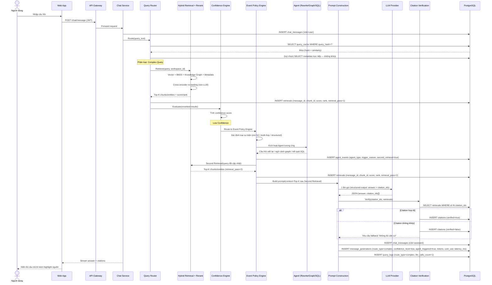

# System Architecture — Enterprise NotebookLM

---

## 1. C4 Model — Component Diagram

Phạm vi: zoom vào bên trong container **Backend API System** (FastAPI) — container trung tâm chứa toàn bộ 13 FR. Hai container ngoài (Web App, LightRAG Core Engine) và các external system giữ nguyên ở mức Container để làm ranh giới.

```mermaid
C4Component
    title Component diagram — Backend API System (Enterprise NotebookLM)

    Person(user, "Workspace User", "Chat, tìm kiếm, tóm tắt — RBAC admin/editor/viewer theo Workspace")
    Person(manager, "Enterprise Manager (Manage)", "Platform Admin Console /admin — quản trị user & observability")

    Container(webapp, "Web App", "Next.js/React", "UI Chat, Search, Upload, Report, Admin Console")
    Container(lightrag, "LightRAG Core Engine", "Dual-level Graph + Vector Index", "Sinh entity/topic/chunk")
    ContainerDb(pg, "PostgreSQL", "RDBMS", "Metadata, users, workspace, chat, log (đóng vai trò Metadata DB)")
    ContainerDb(vecdb, "Vector DB", "Qdrant/pgvector", "Lưu embedding thật")
    ContainerDb(kg, "Knowledge Graph", "Neo4j/NetworkX", "Entity relations")
    ContainerDb(es, "Full-text Search", "Elasticsearch", "BM25 index")
    ContainerDb(objstore, "Object Storage", "MinIO/S3", "File gốc theo version")
    System_Ext(llm, "LLM Provider", "Anthropic API — Claude Haiku/Sonnet")
    System_Ext(llamaparse, "LlamaParse", "Document Understanding API — Markdown + Layout + Metadata")

    Container_Boundary(api, "Backend API System (FastAPI)") {
        Component(gateway, "API Gateway / Auth Middleware", "FastAPI", "JWT + Platform Manage + Workspace RBAC, rate limiting (FR12)")
        Component(workspaceSvc, "Workspace Service", "FastAPI router", "CRUD Workspace, thành viên, quyền Workspace (FR1)")
        Component(ingestSvc, "Document Ingestion Service", "FastAPI + Celery producer", "Upload, versioning, checksum, tạo pipeline_run (FR2)")
        Component(pipelineWorker, "Pipeline Worker", "Celery task", "Document Understanding (LlamaParse) → Cleaning & Normalize → Hierarchical Chunking → Embedding → Graph Extraction → Indexing (FR2, FR13)")
        Component(searchSvc, "Search Service", "FastAPI router", "Hybrid Retrieval Vector+BM25+KG+Metadata, ghi search_history (FR3)")
        Component(reranker, "Re-ranking Layer", "Cross-encoder (non-LLM)", "Xếp hạng lại kết quả truy hồi (FR3)")
        Component(router, "Query Router", "Rule-based + embedding classifier", "Phân loại cache_hit/metadata/factoid/complex, check query_cache trước (FR11)")
        Component(confidenceEngine, "Confidence Engine", "Python module (non-LLM)", "Đánh giá confidence score sau rerank, phân nhánh High/Low Confidence (FR14)")
        Component(eventPolicy, "Event Policy Engine", "Python module", "Chọn Micro Agent theo loại sự kiện khi Low Confidence (FR14)")
        Component(rewriteAgent, "Rewrite Agent", "LLM nhẹ/rule-based", "Viết lại câu hỏi mơ hồ/thiếu ngữ cảnh (FR14)")
        Component(graphAgent, "Graph Agent", "Python module", "Mở rộng truy vấn qua Knowledge Graph cho câu hỏi multi-hop (FR14)")
        Component(sqlAgent, "SQL Agent", "Python module", "Truy vấn trực tiếp Metadata DB cho câu hỏi structured bị phân loại nhầm (FR14)")
        Component(chatSvc, "Chat Service", "FastAPI router", "Quản lý session, chat_messages, streaming response (FR4, FR10)")
        Component(promptSvc, "Prompt Construction", "Python module", "Dựng prompt + gọi LLM structured output tối đa 1 lần (FR4)")
        Component(citationVerify, "Citation Verification Layer", "Deterministic checker", "Đối chiếu citation id với retrievals, verified=true/false (FR5)")
        Component(summarySvc, "Summary Service", "FastAPI router", "Tóm tắt ngắn/chi tiết/chủ đề/bullet (FR6)")
        Component(extractSvc, "Extraction Service", "FastAPI router", "Trích xuất bảng/số liệu/entity/mốc thời gian → JSON (FR7)")
        Component(compareSvc, "Comparison Service", "FastAPI router", "So sánh nhiều tài liệu (FR8)")
        Component(reportSvc, "Report Service", "FastAPI router", "Gộp kết quả → PDF/DOCX/Markdown (FR9)")
        Component(observability, "Observability Module", "Logging/Tracing", "Ghi pipeline_stage_logs, query_logs, agent_events, cost tracking (FR13)")
    }

    Rel(user, webapp, "Sử dụng /workspaces/*", "HTTPS")
    Rel(manager, webapp, "Quản trị /admin/*", "HTTPS")
    Rel(webapp, gateway, "Gọi API", "REST/HTTPS + JWT")

    Rel(gateway, workspaceSvc, "Route")
    Rel(gateway, ingestSvc, "Route")
    Rel(gateway, searchSvc, "Route")
    Rel(gateway, chatSvc, "Route")
    Rel(gateway, summarySvc, "Route")
    Rel(gateway, extractSvc, "Route")
    Rel(gateway, compareSvc, "Route")
    Rel(gateway, reportSvc, "Route")

    Rel(ingestSvc, objstore, "Lưu file version", "S3 API")
    Rel(ingestSvc, pipelineWorker, "Enqueue job", "Celery/Redis")
    Rel(pipelineWorker, llamaparse, "Document Understanding: parse → Markdown+Layout+Metadata", "HTTPS")
    Rel(pipelineWorker, lightrag, "Nạp Hierarchical Chunk vào Dual-level Index")
    Rel(lightrag, vecdb, "Ghi vector")
    Rel(lightrag, kg, "Ghi entity/relation")
    Rel(pipelineWorker, es, "Index BM25")
    Rel(pipelineWorker, pg, "Ghi metadata trích xuất từ Markdown")
    Rel(pipelineWorker, observability, "Ghi stage log")

    Rel(searchSvc, es, "BM25 query")
    Rel(searchSvc, vecdb, "Vector query")
    Rel(searchSvc, kg, "Graph query")
    Rel(searchSvc, pg, "Metadata query")
    Rel(searchSvc, reranker, "Rerank candidates")

    Rel(chatSvc, router, "Gửi câu hỏi")
    Rel(router, pg, "Check query_cache")
    Rel(router, searchSvc, "Nếu complex: Hybrid Retrieval")
    Rel(router, confidenceEngine, "Complex: đánh giá sau Hybrid+Rerank (FR14)")
    Rel(searchSvc, confidenceEngine, "Truyền candidates đã rerank")
    Rel(reranker, confidenceEngine, "Kết quả đã rerank")
    Rel(confidenceEngine, promptSvc, "High Confidence: build prompt trực tiếp")
    Rel(confidenceEngine, eventPolicy, "Low Confidence: chọn agent")
    Rel(eventPolicy, rewriteAgent, "Sự kiện: câu hỏi mơ hồ")
    Rel(eventPolicy, graphAgent, "Sự kiện: cần suy luận multi-hop")
    Rel(eventPolicy, sqlAgent, "Sự kiện: câu hỏi thực chất structured")
    Rel(rewriteAgent, searchSvc, "Second Retrieval (tuỳ chọn)")
    Rel(rewriteAgent, promptSvc, "Sau rewrite + Second Retrieval: build prompt")
    Rel(graphAgent, kg, "Truy vấn Graph mở rộng")
    Rel(sqlAgent, pg, "Truy vấn Metadata DB trực tiếp")
    Rel(eventPolicy, promptSvc, "Sau agent/second retrieval: build prompt")
    Rel(promptSvc, llm, "1 lần gọi LLM (structured output)", "HTTPS")
    Rel(promptSvc, citationVerify, "Kiểm chứng citation")
    Rel(citationVerify, pg, "Ghi citations, retrievals")
    Rel(eventPolicy, observability, "Ghi agent_events (loại agent, lý do, second retrieval)")
    Rel(router, observability, "Ghi query_logs, route_type")

    Rel(summarySvc, llm, "Gọi LLM tóm tắt")
    Rel(extractSvc, llm, "Gọi LLM trích xuất")
    Rel(compareSvc, llm, "Gọi LLM so sánh")
    Rel(reportSvc, pg, "Đọc summary/extraction/comparison/chat")

    Rel(workspaceSvc, pg, "CRUD")
    Rel(chatSvc, pg, "Ghi chat_messages, message_generations")
```

**Ghi chú đọc sơ đồ:** `Query Router`, `Confidence Engine`, `Event Policy Engine` (+ 3 Micro Agent) và `Citation Verification Layer` là các component tách biệt theo đúng yêu cầu kiến trúc mục 7.2 — chúng hoạt động như một "Query Orchestration Service" nằm giữa Chat Service và LightRAG/LLM, có thể scale ngang độc lập vì stateless. `Confidence Engine`/`Event Policy Engine`/Agent **chỉ nằm trên đường đi của nhánh Complex Query** — Cache Hit/Metadata/Factoid vẫn dừng lại ở `Query Router` như thiết kế cũ, không đổi. `LlamaParse` là external system (SaaS API), chỉ được gọi bởi `Pipeline Worker` ở luồng ingestion, không liên quan tới luồng query.

---

## 2. Sequence Diagram — Complex Query, nhánh Low Confidence (AI Chat có Citation + Agent)

Chọn nhánh phức tạp nhất — Complex Query rơi vào **Low Confidence** — vì nó đi qua đầy đủ các thành phần mới: Query Router → cache miss → Hybrid Retrieval → Re-ranking → **Confidence Engine** → **Event Policy Engine** → Agent → **Second Retrieval** → Prompt Construction → LLM → Citation Verification, khớp với các bảng `query_cache`, `retrievals` (có `retrieval_pass`), `agent_events`, `message_generations` (có `confidence_level`), `citations`, `query_logs` trong thiết kế DB v3. Nhánh High Confidence là tập con của sequence này (bỏ qua đoạn Event Policy Engine → Agent → Second Retrieval, đi thẳng từ Confidence Engine sang Prompt Construction) — không vẽ riêng để tránh trùng lặp.

**So sánh nhanh với các nhánh còn lại:**
- **Cache Hit / Metadata Query / Simple Factoid** — đều dừng ở `Query Router`, 0 lần gọi LLM: Cache Hit trả thẳng từ `query_cache`; Metadata Query truy vấn DB trực tiếp; Simple Factoid trích extractive từ chunk có confidence cao — cả ba vẫn ghi 1 dòng vào `query_logs` và `message_generations` để giữ nhất quán thống kê.
- **Complex Query — High Confidence** — là tập con của sequence trên: sau `Confidence Engine` đi thẳng sang `Prompt Construction` (bỏ qua toàn bộ đoạn `Event Policy Engine` → `Agent` → `Second Retrieval`), chỉ có 1 lượt `retrievals` với `retrieval_pass=1`, `message_generations.confidence_level=high`, `agent_triggered=false`.

---

**Ghi chú triển khai:**

- `backend-api` và `celery-worker` tách container riêng để scale ngang độc lập (đúng yêu cầu phi chức năng "microservice-ready, tách rời indexing và truy vấn").
- `Redis` đóng vai trò kép: message broker cho Celery và có thể dùng làm cache tầng ngoài cho `query_cache` (giảm round-trip Postgres khi check hash).
- Toàn bộ traffic ra ngoài (đến Anthropic API và LlamaParse API) chỉ phát sinh từ `backend-api`/`celery-worker` container — dễ áp rate limiting theo Workspace và circuit breaker tập trung tại một điểm (FR12, FR13). LlamaParse chỉ được gọi từ `celery-worker` (luồng ingestion), tách biệt khỏi traffic đến Anthropic API (luồng query + summary/extraction/comparison).
- Dữ liệu mã hoá khi truyền: TLS tại Nginx (client) và giữa các container nên bật TLS nội bộ hoặc network overlay có mã hoá nếu triển khai đa node.

---

## Ánh xạ nhanh về nguồn yêu cầu

| Sơ đồ     | FR / Module liên quan                                                                          |
| --------- | ----------------------------------------------------------------------------------------------- |
| Component | FR1–FR14 (toàn bộ), Module 1–10                                                                 |
| Sequence  | FR4 (AI Chat), FR5 (Citation), FR11 (Query Router), FR14 (Confidence Engine & Agents), FR13 (Observability) |
